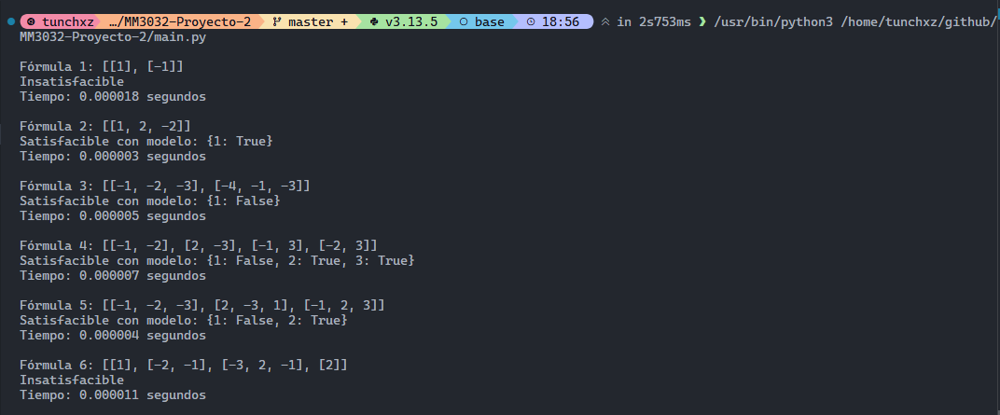

# Proyecto 2: Resolviendo SAT

Este proyecto implementa dos algoritmos para determinar la **satisfacibilidad de fórmulas proposicionales**:  

- **Fuerza Bruta**: prueba todas las posibles asignaciones de valores de verdad.  

- **DPLL (Davis–Putnam–Logemann–Loveland)**: algoritmo recursivo con poda inteligente.  

Las fórmulas se leen desde un archivo `.txt`, donde cada línea representa una fórmula en lógica proposicional. El sistema convierte automáticamente la fórmula a **forma clausal (CNF)** y evalúa su satisfacibilidad.  

## Estructura del Proyecto  

```bash
proyecto_sat/
│
├── main.py                # Punto central: ejecución del programa
├── config.py              # Configuración de algoritmo, tiempos y fórmulas
├── parser_formula.py      # Conversión de expresiones a forma clausal (CNF)
├── algoritmos/
│   ├── fuerza_bruta.py    # Algoritmo de fuerza bruta
│   └── dpll.py            # Algoritmo DPLL
├── formulas.txt           # Archivo con fórmulas de prueba
└── README.md              # Documentación
```  

## **Cómo Ejecutar**  

1. Asegúrate de estar usando Python 3.8+.  

2. Clona este repositorio:  
   
   ~~~bash
   git clone https://github.com/Tunchxz/MM3032-Proyecto-2.git
   cd MM3032-Proyecto-2
   ~~~

3. Ejecuta el archivo principal:  
   
   ~~~bash
   python main.py
   ~~~  

4. Si tienes problemas de dependencias, puedes utilizar el siguiente comando para verificar que cuentas con lo necesario:  
   
   ~~~bash
   pip install sympy
   ~~~  

## Visualización del Proyecto  

A continuación se muestra una vista previa del proyecto:  

  

> Nota: La salida en consola está conformada por:
> 1. La fórmula booleana en su forma clausal  
> 
> 2. El resultado de la satisfacibilidad lógica  
> 
> 3. El tiempo que tardó el algoritmo en encontrar el resultado  
